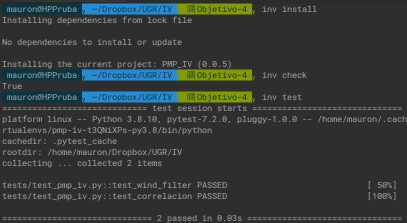

# Repositorio PMP_IV en el curso 22-23


# :thought_balloon: Problema a resolver

1. **Empatizar**. Problema a resolver    

Predecir la probabilidad de que sufran incendios las zonas forestales y residenciales con una escala de niveles del [plan INFOEX](https://www.infoex.info/planes/infoex/#:~:text=Niveles%20de%20incendios&text=Incendios%20de%20nivel%200:%20los,bienes%20de%20car%C3%A1cter%20no%20forestal.) obteniendo un documento en formato PDF con los datos estudiados y gráficas del riesgo.

2. **Definir**. ¿Cuál es el problema exactamente?

Durente el 2022 hasta la fecha del 30 de agosto, han habido 63 grandes incendios según muestra [esta noticia](https://www.rtve.es/noticias/20220902/verano-2022-fuego-grandes-incendios-hectareas/2399690.shtml#:~:text=Los%20grandes%20incendios%20%E2%80%93aquellos%20que,sobre%20Incendios%20Forestales%20(EFFIS).)


Para poder intentar solventar este problema, la idea sería poder predecir en qué zonas forestales puede generarse más riesgo de incendio.

Tratando los siguientes puntos:

- ¿Quién usará esta aplicación?

Analista de datos del gobierno, ya que con el informe que se le da, puede tomar acciones con las autoridades.
Estos reciben un documento con el nivel alerta de incendio y los gráficos, para tomar las medidas necesarias.

- ¿Sirve su despliegue en la nube?

Si, ya que se trataría de un software para distintos clientes y no puede estar centralizado en un sólo sitio.


3. **Idear**. Pensar en qué productos solucionará este problema.

Un software capaz de predecir, el nivel de riesgo que puede haber en las zonas en las que está.

Para ello se usarán datos de un csv (estos datos son validos), se transforman para posteriormente con una IA estimar la probabilidad de incendio que puede tener en esa zona y determinar las zonas que pueden tener vecinos con riesgo de incendio, una vez se ha estimado los vecinos, se decide el nivel de incendio.
Tanto la recopilación de datos, como transformación e IA se especifican en los milestones.

 
<br/>


# Documentos:
- ## :rock: Milestones e HU.
    
    - [Historias e hitos](https://github.com/MauronMP/PMP_IV/blob/Objetivo-5/doc/HistoriasUsuarios_Hitos.md)

- ## :bookmark_tabs: Gestor de dependencias y tareas.
    - [Gestor de tareas](https://github.com/MauronMP/PMP_IV/blob/Objetivo-5/docs/Gestor_Tareas.md)
    - [Gestor de dependencias](https://github.com/MauronMP/PMP_IV/blob/Objetivo-5/docs/Gestor_Dependencias.md)

- ## :speech_balloon: Librerías de asserción y test.
    - [Asserción](https://github.com/MauronMP/PMP_IV/blob/Objetivo-5/docs/Assertion_library.md)
    - [Test](https://github.com/MauronMP/PMP_IV/blob/Objetivo-5/docs/Test_runner.md)
- ## :floppy_disk: Imagen docker.

    -[Imagen](https://github.com/MauronMP/PMP_IV/blob/Objetivo-5/docs/Docker_image.md)
    
# :heavy_check_mark: Instalación, check testeo.
- ## Install.
    ```
    invoke install
    ```
- ## Test.
    ```
    invoke test
- ## Check.
    ```
    invoke check
- ## Demostración.

   

# :whale2: Docker.

- Descargar el [repositorio](https://github.com/MauronMP/PMP_IV/tree/Objetivo-5).
- Ejecutar 
    ```
    docker run -u 1001 -t -v `pwd`:/app/test mauronmp/pmp_iv
    ```